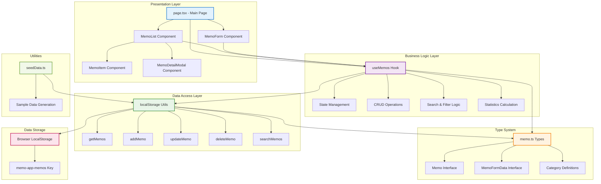

# 메모 앱 시스템 아키텍처

## 개요

Next.js 기반의 클라이언트 사이드 메모 애플리케이션의 시스템 아키텍처입니다. LocalStorage를 사용하여 데이터를 저장하며, React 컴포넌트와 커스텀 훅을 통해 상태를 관리합니다.

## 시스템 아키텍처 다이어그램

## 각 레이어 설명

### 1. Presentation Layer (프레젠테이션 계층)
- **page.tsx**: 메인 페이지 컴포넌트로 전체 UI를 구성하고 상태를 관리
- **MemoList**: 메모 목록을 표시하고 검색/필터링 인터페이스 제공
- **MemoForm**: 메모 생성 및 편집을 위한 폼 컴포넌트
- **MemoItem**: 개별 메모를 표시하는 컴포넌트
- **MemoDetailModal**: 메모 상세 내용을 모달로 표시

### 2. Business Logic Layer (비즈니스 로직 계층)
- **useMemos Hook**: 메모 관련 모든 비즈니스 로직을 담당
  - 상태 관리 (memos, loading, searchQuery, selectedCategory)
  - CRUD 작업 (생성, 읽기, 업데이트, 삭제)
  - 검색 및 필터링 로직
  - 통계 정보 계산

### 3. Data Access Layer (데이터 접근 계층)
- **localStorage Utils**: LocalStorage와의 모든 상호작용을 담당
  - 메모 저장/로드
  - CRUD 연산
  - 검색 기능
  - 데이터 검증

### 4. Type System (타입 시스템)
- **memo.ts**: TypeScript 타입 정의
  - Memo 인터페이스
  - MemoFormData 인터페이스
  - 카테고리 타입 및 상수

### 5. Data Storage (데이터 저장소)
- **Browser LocalStorage**: 클라이언트 사이드 데이터 저장
  - JSON 형태로 메모 데이터 저장
  - 브라우저 세션 간 데이터 지속성 제공

### 6. Utilities (유틸리티)
- **seedData.ts**: 초기 샘플 데이터 생성 및 시딩

## 데이터 플로우

1. **생성**: 사용자 입력 → MemoForm → useMemos → localStorage → LocalStorage
2. **조회**: LocalStorage → localStorage → useMemos → MemoList → MemoItem
3. **검색/필터링**: 사용자 입력 → useMemos (필터링 로직) → MemoList
4. **업데이트**: MemoForm → useMemos → localStorage → LocalStorage
5. **삭제**: MemoItem → useMemos → localStorage → LocalStorage

## 주요 특징

- **클라이언트 사이드 앱**: 백엔드 서버 없이 브라우저에서 완전히 동작
- **반응형 상태 관리**: React Hook을 사용한 효율적인 상태 관리
- **타입 안전성**: TypeScript를 통한 타입 안전성 보장
- **모듈화**: 관심사 분리를 통한 유지보수성 향상
- **확장 가능성**: 컴포넌트 기반 아키텍처로 기능 확장 용이

## 기술 스택

- **Frontend**: Next.js, React, TypeScript
- **스타일링**: Tailwind CSS
- **상태 관리**: React Hooks (useState, useEffect, useMemo)
- **데이터 저장**: Browser LocalStorage
- **개발 도구**: ESLint, Playwright (테스트)